# AI Agents: A Complete Conceptual Guide with Visual Diagrams

Based on the comprehensive AI Agents Crash Course series by Avi Chawla & Akshay Pachaar from Daily Dose of Data Science

---

## 🎯 What Are AI Agents?

AI agents represent the next evolution beyond RAG (Retrieval-Augmented Generation) systems. While RAG enhanced LLMs with external data access, it still relies on rigid, programmatic workflows defined by developers. AI agents are **autonomous systems that can reason, think, plan, figure out relevant sources, extract information when needed, take actions, and even correct themselves when something goes wrong**.

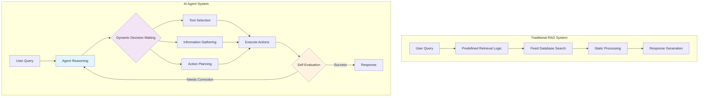

The key distinction is autonomy: instead of following predetermined steps where programmers define every database search and processing logic, agents can dynamically gather information, analyze and process data to make real-time decisions, and operate without explicit programmer-defined steps for every scenario.

---

## 🧠 Thinking in First Principles: The Foundations of Agentic Systems

Before diving into implementation patterns and frameworks, it's crucial to understand the fundamental principles that make AI agents work. This first-principles thinking reveals that sophisticated agent behavior emerges from simple, well-designed components rather than complex built-in capabilities.

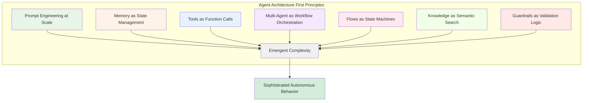

### **First Principle 1: Agents Are Prompt Engineering at Scale**

At their core, AI agents are not magical systems with built-in reasoning abilities. They are **carefully orchestrated prompt engineering systems** that create the illusion of autonomous behavior through structured instructions and constrained interaction patterns.

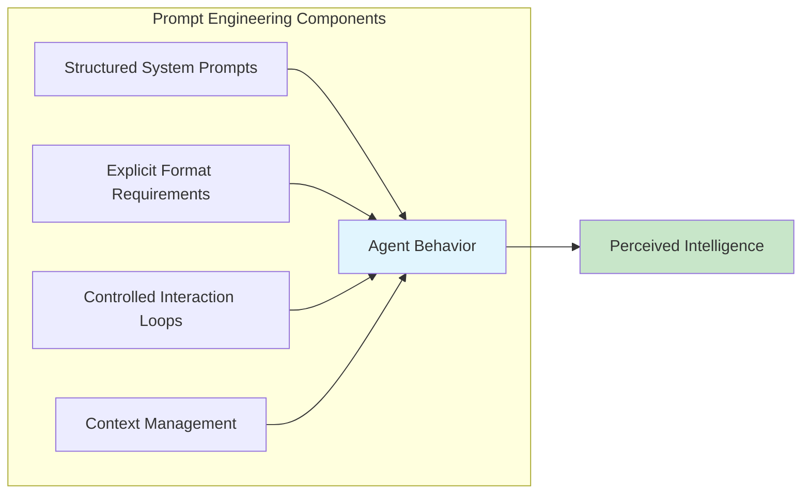

**The Revelation**: When you examine agent frameworks like CrewAI or implement agents from scratch, you discover that agent "intelligence" comes from:
- **Structured system prompts** that define behavioral protocols
- **Explicit format requirements** that enable automated parsing
- **Controlled interaction loops** that create step-by-step reasoning
- **Context management** that maintains coherent conversations

**Key Insight**: The sophistication comes not from the LLM's inherent capabilities, but from how we structure the interaction patterns and prompt templates that guide the LLM's responses.

### **First Principle 2: Memory Is State, Not Magic**

Memory in AI agents is fundamentally about **state management across time**, not mystical learning capabilities. Understanding this principle clarifies how to design effective memory systems.

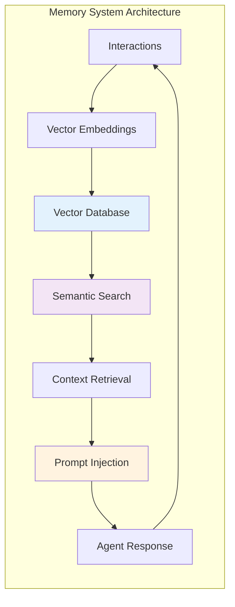

**Core Memory Mechanics**:
- **Storage**: Convert interactions to searchable vectors using embedding models
- **Retrieval**: Use semantic similarity to find relevant past context
- **Injection**: Automatically include relevant context in new prompts
- **Persistence**: Maintain state across sessions through database storage

**The Reality**: Memory doesn't make agents "learn" in the human sense. Instead, it provides a sophisticated context lookup system that makes agents appear to remember and learn from past interactions.

### **First Principle 3: Tools Are Function Calls, Not Intelligence**

Tool usage in agents is simply **structured function calling with natural language interfaces**. The "intelligence" is in the prompt engineering that teaches agents when and how to use available functions.

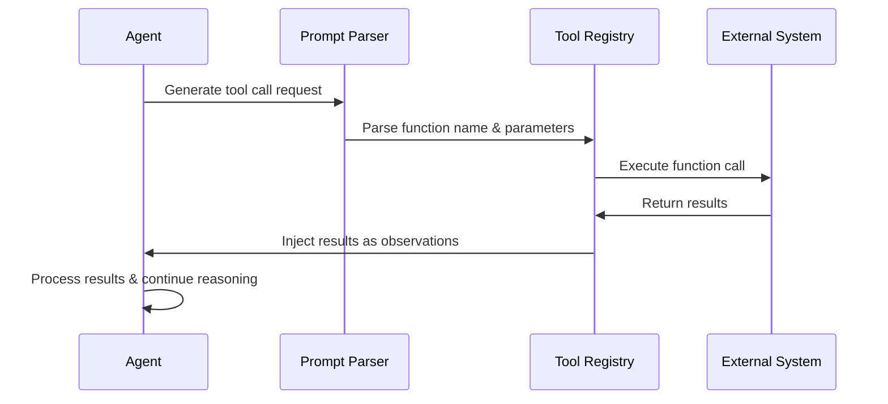

**Tool Integration Pipeline**:
1. **Function Metadata**: Extract function signatures, parameters, and documentation
2. **Prompt Integration**: Include tool descriptions in agent system prompts
3. **Response Parsing**: Use regex or structured outputs to extract tool calls
4. **Execution**: Call actual functions with parsed parameters
5. **Result Injection**: Feed function results back as observations

**Key Understanding**: Tools don't make agents smarter; they extend agents' capabilities by providing access to external systems and computations.

### **First Principle 4: Multi-Agent Systems Are Workflow Orchestration**

Multi-agent systems are essentially **distributed workflow management** where different agents handle specialized tasks in a coordinated pipeline.

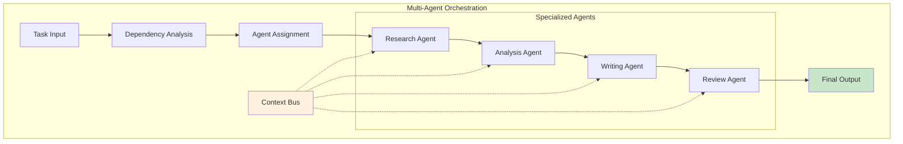

**Orchestration Fundamentals**:
- **Dependency Management**: Topological sorting ensures agents run in correct order
- **Context Passing**: Output from one agent becomes input context for dependent agents
- **Specialization**: Each agent has focused responsibilities and appropriate tools
- **Error Isolation**: Agent failures don't cascade throughout the entire system

**Core Insight**: The "collaboration" between agents is structured data flow management, not spontaneous communication.

### **First Principle 5: Flows Are State Machines with LLM Transitions**

CrewAI Flows and similar orchestration systems are **finite state machines** where LLMs handle the transition logic between states.

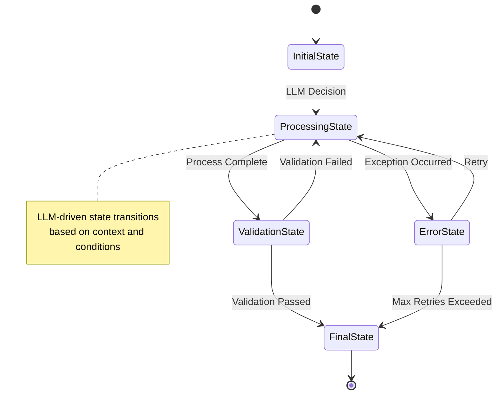

**Flow Architecture**:
- **States**: Different phases of workflow execution
- **Transitions**: LLM-driven decisions about next actions
- **State Storage**: Persistent data that flows between states
- **Event Triggers**: Conditions that initiate state transitions

**Understanding**: Flows don't create new AI capabilities; they provide structured frameworks for managing complex, multi-step processes with AI-driven decision points.

### **First Principle 6: Knowledge Is Semantic Search, Not Understanding**

Knowledge systems in agents are sophisticated **semantic search engines** that retrieve relevant context based on query similarity, not true comprehension systems.

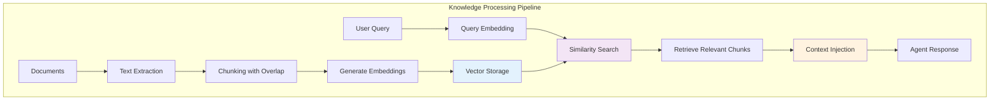

**Knowledge Processing Pipeline**:
1. **Content Ingestion**: Load documents and convert to text
2. **Chunking**: Break content into manageable pieces with overlap
3. **Embedding**: Convert text chunks to vector representations
4. **Storage**: Store vectors in searchable databases
5. **Retrieval**: Find similar content based on query vectors
6. **Context Injection**: Include relevant chunks in agent prompts

**Reality Check**: Agents don't "know" things in human terms; they have sophisticated retrieval systems that surface relevant information when needed.

### **First Principle 7: Guardrails Are Validation Logic, Not Safety Intelligence**

Guardrails in agent systems are **programmatic validation functions** that check outputs against predefined criteria, not intelligent safety systems.

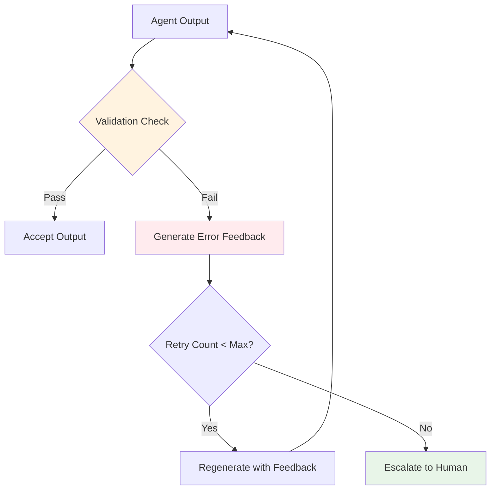

**Guardrail Mechanics**:
- **Validation Functions**: Boolean logic that checks output compliance
- **Retry Loops**: Automatic re-execution when validation fails
- **Error Feedback**: Specific guidance for improvement attempts
- **Constraint Enforcement**: Hard limits on behavior and outputs

**Key Point**: Guardrails provide deterministic quality control, not adaptive safety reasoning.

---

## 🏗️ The Emergent Complexity Principle

When these first principles combine, they create **emergent complexity** that appears more sophisticated than the sum of its parts:

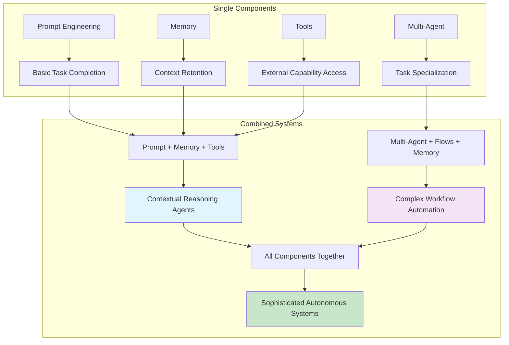

**Single Components**:
- Prompt engineering → Basic task completion
- Memory → Context retention
- Tools → External capability access
- Multi-agent → Task specialization

**Combined Systems**:
- Prompt + Memory + Tools → Contextual reasoning agents
- Multi-agent + Flows + Memory → Complex workflow automation
- All components together → Sophisticated autonomous systems

**The Illusion**: The combination of simple, well-designed components creates systems that appear to have genuine intelligence, reasoning, and autonomy—but are actually sophisticated orchestrations of deterministic processes guided by LLM decision-making.

---

## 🎯 Design Philosophy: Human-Centered Workflow Thinking

The series emphasizes a crucial design philosophy: **"Always think of your agentic system as a structured design—just as you would in a real-world human workflow."**

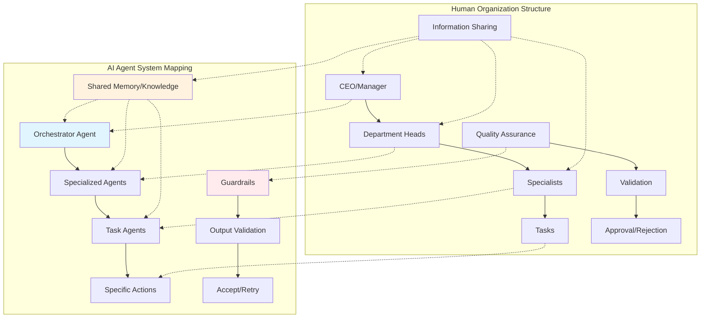

### **The Human Workflow Mapping Approach**

When designing AI agent systems, ask yourself:
- **How would I structure this process if I were working with a team of humans?**
- **Which tasks need to be done first, and which can be done in parallel?**
- **Who (or which AI agent) should oversee and validate the work?**
- **Which agents should be enforced with guardrails?**
- **What information needs to be shared between team members?**

### **Organizational Intelligence Principles**

Real-world organizations don't execute tasks sequentially—they have:
- **Hierarchical structures** where managers delegate and coordinate
- **Specialized roles** with focused expertise areas
- **Information sharing protocols** for collaboration
- **Quality assurance processes** for output validation
- **Escalation procedures** for handling exceptions

**Agent System Translation**: Effective agentic systems mirror these organizational patterns through hierarchical processes, specialized agents, shared memory/knowledge systems, guardrails, and human-in-the-loop mechanisms.

---

## 🧠 Six Fundamental Building Blocks

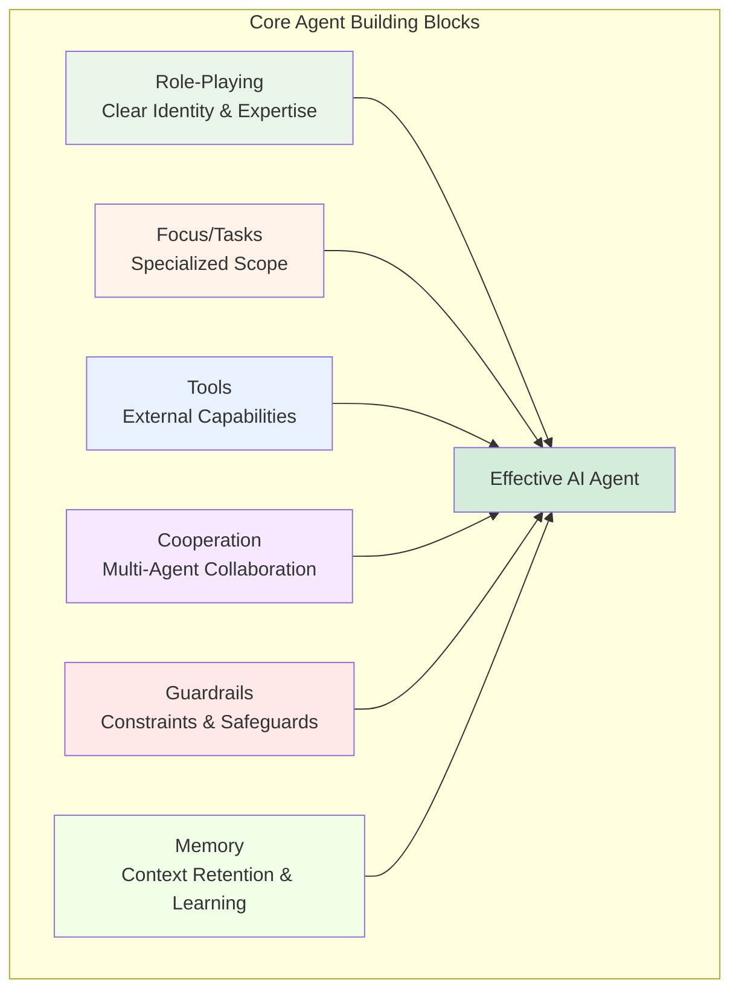

### **1. Role-Playing: Clear Identity and Expertise**
Agents need well-defined roles that establish their function and expertise within the system. Rather than generic AI assistants, effective agents have specific identities like "Senior Technical Writer" or "Senior contract lawyer specializing in corporate law." This role-playing provides more structured, relevant, and aligned responses by giving agents clear behavioral guidelines and expertise boundaries.

### **2. Focus/Tasks: Specialized Scope for Better Performance**
Agents perform better when given specific, narrow focus areas rather than being overloaded with multiple responsibilities. This specialization reduces hallucinations, improves accuracy, and ensures consistency. Multiple specialized agents working together typically outperform single generalist agents attempting to handle diverse tasks.

### **3. Tools: External Capabilities for Enhanced Power**
Tools enable agents to interact with real-world systems and data beyond their training knowledge. This includes capabilities like web search, API access, file operations, code execution, and document analysis. The key is choosing essential tools for specific tasks rather than overwhelming agents with unnecessary options.

### **4. Cooperation: Multi-Agent Collaboration**
Complex problems benefit from networks of specialized agents working together, where each agent contributes distinct expertise. This collaborative approach improves decision-making through specialization and allows agents to exchange insights and refine responses collectively.

### **5. Guardrails: Constraints and Safeguards**
Without proper constraints, agents can hallucinate, enter infinite loops, or make unreliable decisions. Guardrails keep agents on track through validation checkpoints, limiting tool usage, establishing fallback mechanisms, and preventing generation of non-factual content.

### **6. Memory: Context Retention and Learning**
Memory is the most critical component for agent effectiveness. Without memory, agents start fresh every interaction, losing all previous context. With memory, agents can improve over time, remember past actions, and create cohesive responses across sessions.

---

## 🔄 Advanced Orchestration with Flows

**CrewAI Flows** provide infrastructure to design workflows that seamlessly integrate deterministic processes with AI's adaptive reasoning capabilities. Flows solve the challenge of balancing structured workflows with AI-driven autonomy, ensuring agents have freedom to interpret and respond to complex inputs within a controlled and predictable framework.

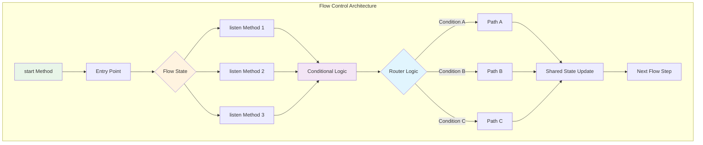

### **Flow Control Mechanisms**

**Entry Points and Dependencies**: Flows use `@start()` decorators to identify entry points and `@listen()` decorators to create task dependencies, enabling sequential execution where methods wait for specific outputs before proceeding.

**State Management**: Flow state acts as a shared dictionary that stores intermediate values throughout execution, enabling data sharing between different flow steps while maintaining context across the entire workflow.

**Conditional Logic**: Flows support sophisticated routing through:
- **OR Logic**: Triggers when any one of multiple conditions is met
- **AND Logic**: Executes only when all specified conditions are satisfied  
- **Router Logic**: Enables dynamic execution paths based on decision logic

### **Multi-Crew Workflows**

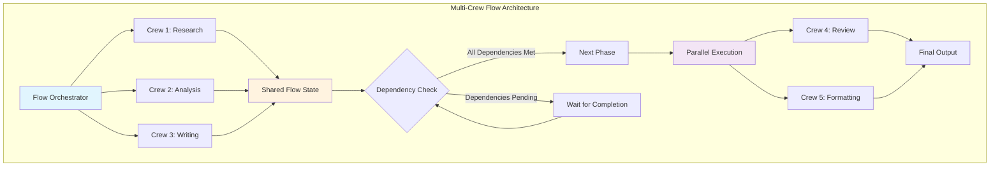

Advanced flows support multiple specialized crews working together within a single workflow. Each crew handles specific responsibilities while being orchestrated by the flow's control mechanisms. This enables parallel execution where multiple crews can operate simultaneously for efficiency, along with hierarchical crew structures for complex task decomposition.

---

## 🛠️ Advanced Robustness Techniques

### **Guardrails Implementation**

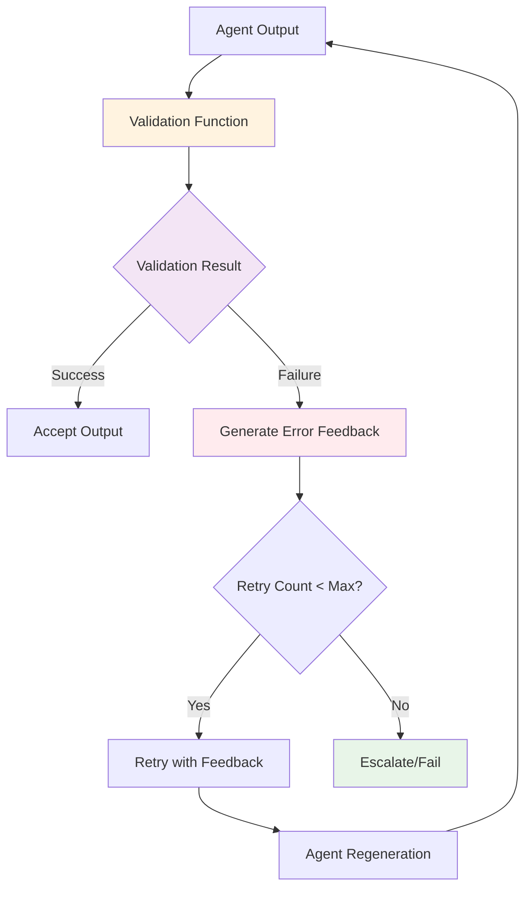

Guardrails enforce constraints through validation functions that return success/failure tuples. When validation fails, agents automatically retry with error feedback until successful or maximum retries are reached. This prevents common failure modes and ensures output reliability.

### **Task Output Referencing**

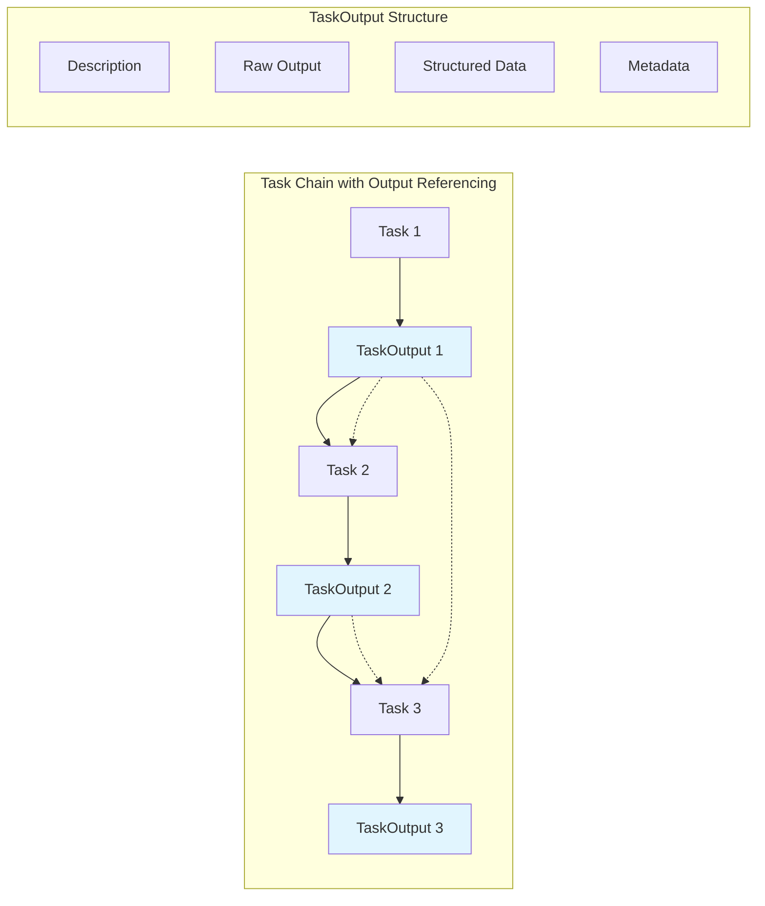

Tasks can reference previous task outputs to create context-aware workflows. Each task produces a structured TaskOutput object containing description, raw output, structured data, and metadata. This enables agents to build intelligently on previous results rather than working in isolation.

### **Asynchronous Execution**

```mermaid
gantt
    title Asynchronous vs Sequential Task Execution
    dateFormat X
    axisFormat %s
    
    section Sequential
    Task A    :done, seq-a, 0, 3
    Task B    :done, seq-b, after seq-a, 3
    Task C    :done, seq-c, after seq-b, 3
    Task D    :done, seq-d, after seq-c, 3
    Total Sequential Time: 12s
    
    section Asynchronous
    Task A    :done, async-a, 0, 3
    Task B    :done, async-b, 0, 3
    Task C    :done, async-c, 0, 3
    Task D    :done, async-d, 0, 3
    Total Async Time: 3s
```

Independent tasks can run concurrently to optimize performance, dramatically reducing total processing time compared to sequential execution. This is especially beneficial for workflows involving multiple independent operations.

### **Hierarchical Processes**

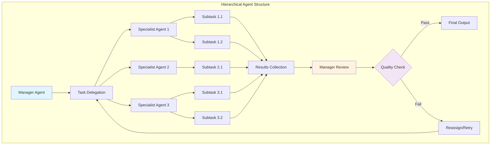

Hierarchical structures introduce managerial agents that oversee and coordinate specialized agents, mimicking real-world organizational workflows. Manager agents can delegate tasks and review outputs, while specialized agents focus on specific expertise areas without delegation capabilities.

---

## 📚 Knowledge vs Tools vs Memory

Understanding the distinction between these three concepts is crucial for effective agent design:

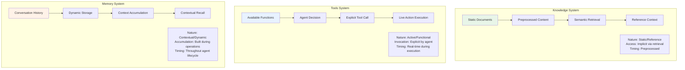

### **Tools**
- **Purpose**: Perform actions (web search, file reading, API calls)
- **Nature**: Active/Functional
- **Invocation**: Explicitly called by the agent
- **Timing**: Happens live during agent execution

### **Knowledge**
- **Purpose**: Provide reference context for reasoning (PDFs, CSVs, documentation)
- **Nature**: Static/Reference
- **Access**: Implicitly accessed via semantic retrieval
- **Timing**: Preprocessed and stored prior to task execution

### **Memory**
- **Purpose**: Store and recall dynamic information (conversation history, user preferences)
- **Nature**: Contextual/Dynamic
- **Accumulation**: Built up during operations
- **Timing**: Accumulated and retrieved throughout agent lifecycle

---

## 🧠 Memory Architecture: Five Types

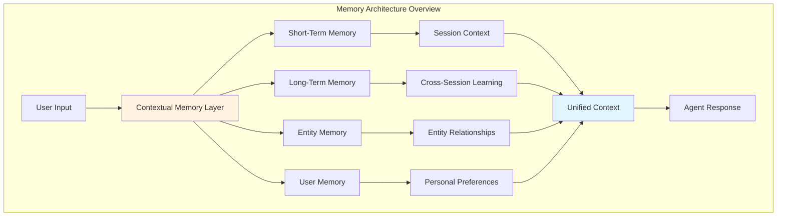

### **1. Short-Term Memory**
Maintains immediate context and coherence within a single session, storing recent user-agent interactions with semantic search capabilities. This enables agents to reference earlier parts of current conversations.

### **2. Long-Term Memory**
Accumulates knowledge and experience across multiple sessions with structured storage including metadata, quality scores, and contextual insights. This allows agents to learn patterns and avoid repeated mistakes across different executions.

### **3. Entity Memory**
Tracks information about specific entities (people, projects, objects) through relationship-based knowledge graphs. Stores facts associated with specific entities using semantic connections rather than exact matching.

### **4. User Memory**
Enables personalization by tracking individual user preferences and details in user-specific persistent storage. This supports customized experiences while maintaining privacy through user isolation.

### **5. Contextual Memory**
Acts as an intelligent orchestration layer that automatically combines and prioritizes information from all other memory types. Rather than agents separately accessing different memory stores, Contextual Memory creates a unified intelligence layer that delivers the most relevant information regardless of storage location.

---

## 🎯 Agentic Design Patterns

### **ReAct Pattern (Reasoning and Acting)**

```mermaid
graph TD
    A[Initial Query] --> B[Thought: What do I need to do?]
    B --> C[Action: Execute tool/search]
    C --> D[Observation: Analyze results]
    D --> E{Goal Achieved?}
    E -->|No| F[Thought: What's next?]
    F --> G[Action: Next step]
    G --> H[Observation: New results]
    H --> E
    E -->|Yes| I[Final Answer]
    
    style B fill:#e8f5e8
    style C fill:#e8f2ff
    style D fill:#fff2e8
    style F fill:#e8f5e8
    style G fill:#e8f2ff
    style H fill:#fff2e8
```

The ReAct pattern follows a "Thought → Action → Observation" loop where agents don't generate direct answers immediately. Instead, they think step-by-step about what to do next, perform intermediate actions, observe results, and chain multiple iterations until reaching a final answer. This pattern is ideal for exploratory problems and uncertain environments.

### **Planning Pattern**

```mermaid
graph TD
    A[Complex Problem] --> B[Comprehensive Planning Phase]
    B --> C[Step 1: Analyze Requirements]
    B --> D[Step 2: Identify Resources]
    B --> E[Step 3: Create Roadmap]
    B --> F[Step 4: Risk Assessment]
    
    C --> G[Execution Phase]
    D --> G
    E --> G
    F --> G
    
    G --> H[Execute Step 1]
    H --> I[Execute Step 2]
    I --> J[Execute Step 3]
    J --> K[Execute Step N]
    K --> L[Final Result]
    
    style B fill:#e1f5fe
    style G fill:#f3e5f5
```

The Planning pattern follows a "Plan First, Execute Later" approach where agents create comprehensive roadmaps before taking any actions. This strategic thinking provides a global view of the problem rather than step-by-step reactions. The Planning pattern excels at multi-step workflows, structured problems, and strategic execution scenarios.

### **Multi-Agent Pattern**

```mermaid
graph TD
    subgraph "Multi-Agent Collaboration Pipeline"
        A[Input Task] --> B[Task Decomposition]
        B --> C[Agent 1: Research]
        B --> D[Agent 2: Analysis]
        B --> E[Agent 3: Writing]
        
        C --> F[Intermediate Results]
        D --> F
        E --> F
        
        F --> G[Agent 4: Review]
        G --> H{Quality Check}
        H -->|Pass| I[Final Output]
        H -->|Needs Revision| J[Feedback Loop]
        J --> C
        J --> D
        J --> E
    end
    
    style F fill:#fff3e0
    style G fill:#e1f5fe
    style H fill:#f3e5f5
```

The Multi-Agent pattern coordinates multiple specialized agents working together in controlled pipelines. This involves specialized agents with focused roles and limited toolsets, sequential pipelines
