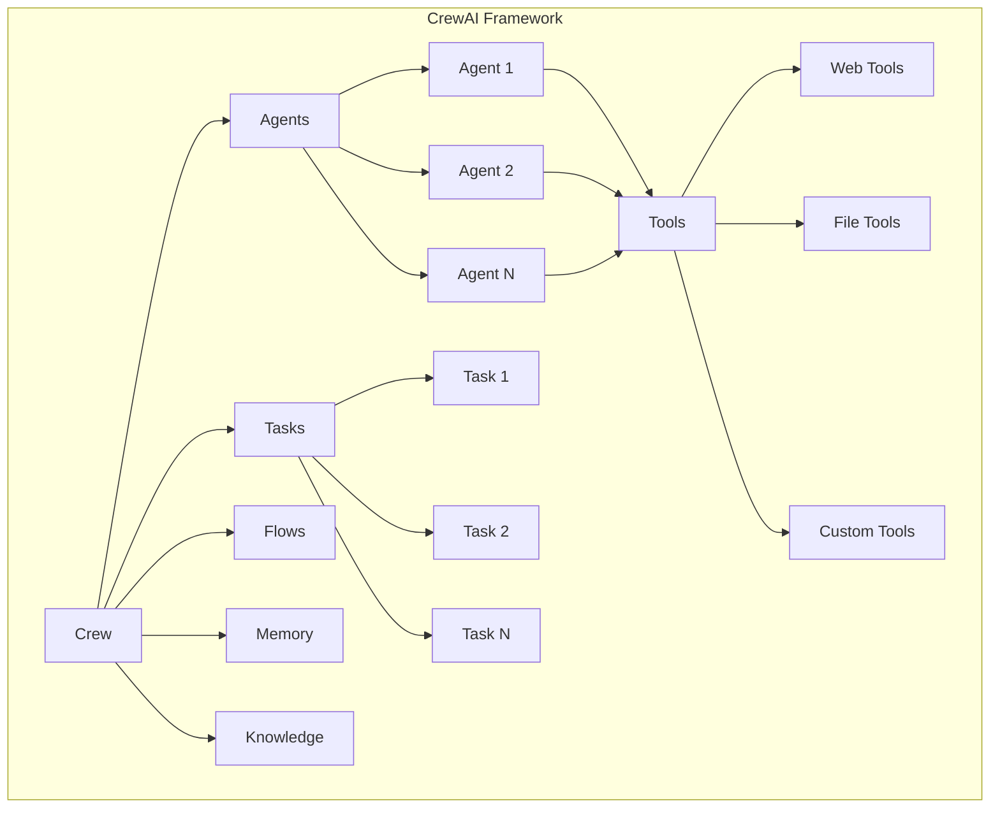
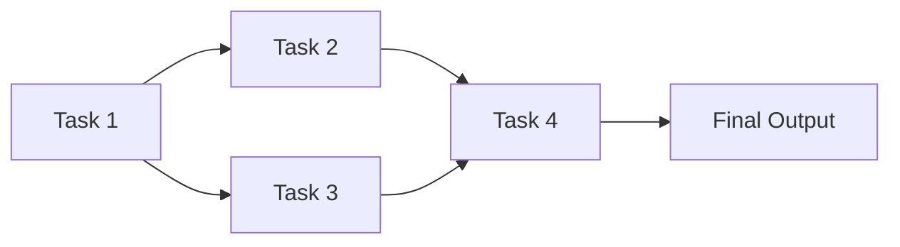
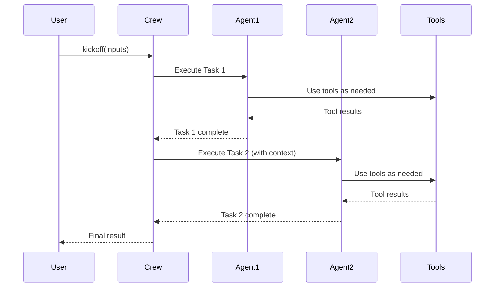
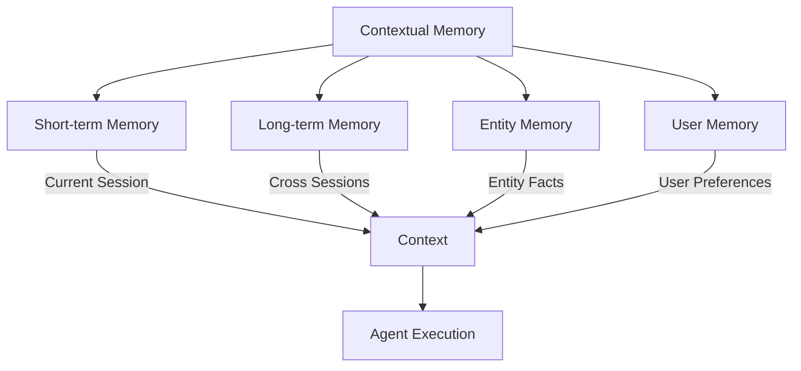
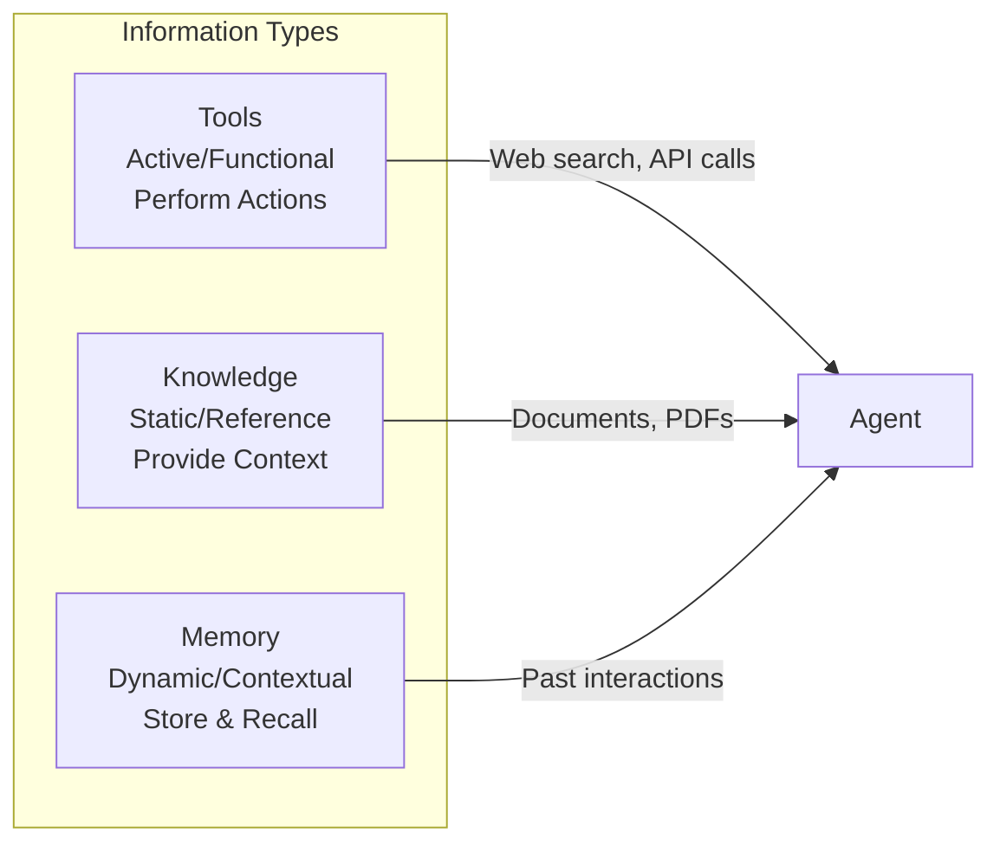
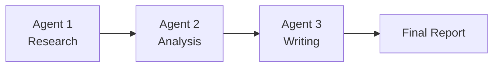
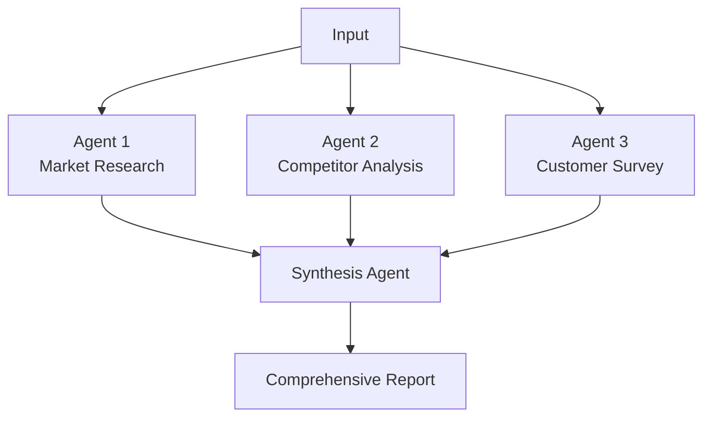
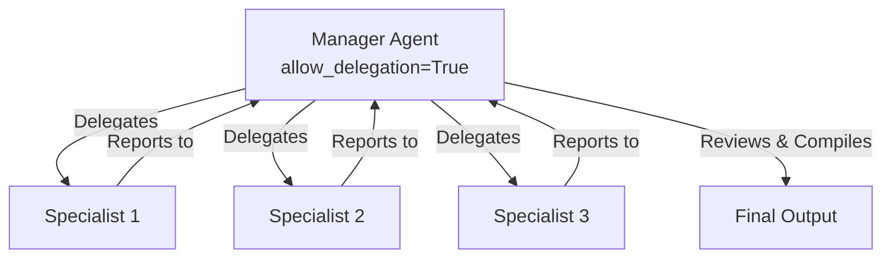
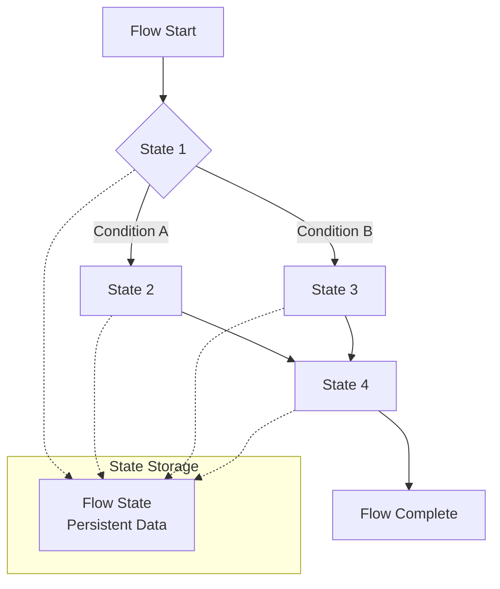

# CrewAI: Complete Conceptual Guide

## 🎯 What is CrewAI?

CrewAI is an open-source framework designed to orchestrate autonomous AI agents that work together as specialized teams (crews) to accomplish complex multi-step tasks. Unlike single-agent systems, CrewAI enables the creation of sophisticated workflows where multiple AI agents collaborate, each bringing specific expertise and capabilities to solve problems that would be challenging for individual agents.

## 🏗️ Core Architecture Overview



## 🧩 Core Entities and Components

### 1. **Agents** - The AI Workers

Agents are the fundamental building blocks of CrewAI - autonomous AI units with specific roles, goals, and capabilities.

**Key Properties:**
- **Role**: Defines the agent's expertise and identity (e.g., "Senior Data Analyst", "Content Writer")
- **Goal**: Specific objective the agent aims to achieve
- **Backstory**: Context that shapes the agent's personality and approach
- **Tools**: External capabilities the agent can use
- **Memory**: Context retention across interactions
- **LLM**: The underlying language model powering the agent

**Agent Configuration Example:**
```python
research_agent = Agent(
    role="Senior Research Analyst",
    goal="Find and analyze relevant information on given topics",
    backstory="Expert researcher with 10+ years of experience in data analysis",
    tools=[web_search_tool, file_reader_tool],
    memory=True,
    verbose=True
)
```

### 2. **Tasks** - The Work Units

Tasks define specific jobs that agents need to complete, with clear descriptions, expected outputs, and success criteria.

**Key Properties:**
- **Description**: What needs to be accomplished
- **Expected Output**: Format and content requirements for the result
- **Agent**: Which agent is responsible for the task
- **Tools**: Specific tools available for this task
- **Context**: Dependencies on other tasks
- **Output Format**: Structured output requirements (Pydantic, JSON)

**Task Flow Patterns:**


### 3. **Crews** - The Orchestrators

Crews manage the coordination and execution of multiple agents and tasks, defining how they work together.

**Key Properties:**
- **Agents**: List of agents in the crew
- **Tasks**: List of tasks to be executed
- **Process**: Execution strategy (Sequential, Hierarchical, Parallel)
- **Memory**: Shared memory across agents
- **Manager**: Optional manager agent for hierarchical processes

**Crew Execution Process:**


### 4. **Tools** - External Capabilities

Tools extend agent capabilities beyond their training data, enabling interaction with external systems and services.

**Built-in Tools:**
- **Web Search** (SerperDevTool): Internet search capabilities
- **File Operations** (FileReadTool, FileWriteTool): File system interactions
- **Code Execution** (CodeInterpreterTool): Running and executing code
- **Database Access** (DatabaseTool): Query databases
- **API Integration** (Various API tools)

**Custom Tool Development:**
```python
from crewai_tools import BaseTool

class CustomCalculatorTool(BaseTool):
    name: str = "Calculator"
    description: str = "Perform mathematical calculations"
    
    def _run(self, expression: str) -> str:
        try:
            result = eval(expression)
            return f"Result: {result}"
        except Exception as e:
            return f"Error: {e}"
```

### 5. **Memory System** - Context and Learning

CrewAI implements a sophisticated five-tier memory architecture:



**Memory Types:**

1. **Short-term Memory**: Session-specific context and conversation history
2. **Long-term Memory**: Persistent knowledge accumulated across sessions
3. **Entity Memory**: Information about specific entities (people, places, things)
4. **User Memory**: Personalized preferences and user-specific data
5. **Contextual Memory**: Intelligent orchestration layer combining all memory types

### 6. **Knowledge Sources** - Static Information

Knowledge sources provide reference material that agents can access during task execution.

**Supported Formats:**
- Text files (.txt)
- PDFs
- CSV/Excel files
- JSON documents
- Markdown files
- Custom API sources

**Knowledge vs Tools vs Memory:**


### 7. **Flows** - Advanced Orchestration

Flows provide event-driven workflow control with sophisticated state management and conditional logic.

**Flow Control Mechanisms:**
```mermaid
graph TD
    Start[@start] --> Method1[Method 1]
    Method1 --> Listen1[@listen Method1]
    Listen1 --> Method2[Method 2]
    
    Router[@router] --> Choice{Decision}
    Choice -->|Condition A| PathA[Path A]
    Choice -->|Condition B| PathB[Path B]
    
    AND[and_ logic] --> |All conditions met| Execute
    OR[or_ logic] --> |Any condition met| Execute
```

**Flow State Management:**
- **Unstructured**: Dictionary-like flexible storage
- **Structured**: Pydantic-based type-safe state management

## 🎭 Agent Interaction Patterns

### 1. Sequential Processing


### 2. Parallel Processing


### 3. Hierarchical Processing


### 4. Flow-Based Processing


## 🔄 Execution Patterns and Workflows

### 1. Basic Crew Execution
```python
# Define agents
researcher = Agent(role="Researcher", goal="Find information", ...)
writer = Agent(role="Writer", goal="Create content", ...)

# Define tasks
research_task = Task(description="Research topic X", agent=researcher, ...)
writing_task = Task(description="Write article", agent=writer, context=[research_task], ...)

# Create and run crew
crew = Crew(agents=[researcher, writer], tasks=[research_task, writing_task])
result = crew.kickoff(inputs={"topic": "AI Agents"})
```

### 2. Flow-Based Execution
```python
@CrewBase
class ContentCreationFlow(Flow):
    @start()
    def research_phase(self):
        # Initial research
        return research_crew.kickoff()
    
    @listen("research_phase")
    def writing_phase(self, research_output):
        # Writing based on research
        return writing_crew.kickoff(inputs={"research": research_output})
    
    @router("writing_phase")
    def review_routing(self):
        if self.state.needs_review:
            return "review"
        return "publish"
    
    @listen("review")
    def review_phase(self):
        return review_crew.kickoff()
```

## 🛡️ Advanced Features

### 1. Guardrails - Quality Control
```python
def validate_output_length(output):
    if len(output.split()) > 500:
        return (False, "Output too long - please summarize")
    return (True, output)

task = Task(
    description="Summarize the report",
    agent=summarizer_agent,
    guardrail=validate_output_length
)
```

### 2. Human-in-the-Loop
```python
review_task = Task(
    description="Review the content for accuracy",
    agent=reviewer_agent,
    human_input=True  # Enables human validation
)
```

### 3. Asynchronous Execution
```python
research_task = Task(
    description="Research market trends",
    agent=research_agent,
    async_execution=True  # Runs in parallel
)

analysis_task = Task(
    description="Analyze competitor data", 
    agent=analysis_agent,
    async_execution=True  # Runs in parallel
)

synthesis_task = Task(
    description="Combine research and analysis",
    agent=synthesis_agent,
    context=[research_task, analysis_task]  # Waits for both
)
```

### 4. Multimodal Capabilities
```python
image_analyzer = Agent(
    role="Image Quality Inspector",
    goal="Analyze product images for defects",
    multimodal=True,  # Enables image processing
    tools=[image_analysis_tool]
)
```

## 📊 Configuration Management

### YAML-Based Configuration
CrewAI supports configuration-driven development for better maintainability:

**agents.yaml:**
```yaml
researcher:
  role: "Senior Research Analyst"
  goal: "Conduct thorough research on assigned topics"
  backstory: "Expert researcher with deep analytical skills"

writer:
  role: "Content Writer"
  goal: "Create engaging, well-structured content"
  backstory: "Professional writer with expertise in technical communication"
```

**tasks.yaml:**
```yaml
research_task:
  description: "Research the given topic thoroughly"
  agent: researcher
  expected_output: "Comprehensive research summary with key findings"

writing_task:
  description: "Write an article based on research findings"
  agent: writer
  expected_output: "Well-structured article with clear sections"
```

## 🎯 Use Cases and Applications

### 1. Content Creation Pipeline
- **Research Agent**: Gathers information from multiple sources
- **Analysis Agent**: Extracts key insights and trends
- **Writing Agent**: Creates structured content
- **Review Agent**: Ensures quality and accuracy

### 2. Business Intelligence System
- **Data Collection Agent**: Gathers business metrics
- **Analysis Agent**: Performs statistical analysis
- **Visualization Agent**: Creates charts and dashboards
- **Reporting Agent**: Compiles executive summaries

### 3. Customer Support Automation
- **Classification Agent**: Categorizes support requests
- **Research Agent**: Finds relevant solutions
- **Response Agent**: Crafts appropriate responses
- **Escalation Agent**: Handles complex cases

### 4. Software Development Assistant
- **Requirements Agent**: Analyzes project requirements
- **Architecture Agent**: Designs system architecture
- **Implementation Agent**: Generates code components
- **Testing Agent**: Creates test cases and documentation

## 🚀 Getting Started

### Basic Setup
```bash
pip install crewai
pip install crewai-tools
```

### Environment Configuration
```bash
# .env file
OPENAI_API_KEY="your-api-key"
SERPER_API_KEY="your-serper-key"  # For web search
```

### Simple Example
```python
from crewai import Agent, Task, Crew
from crewai_tools import SerperDevTool

# Create tools
search_tool = SerperDevTool()

# Create agent
researcher = Agent(
    role='Research Analyst',
    goal='Provide accurate research on given topics',
    backstory='Experienced researcher with attention to detail',
    tools=[search_tool],
    verbose=True
)

# Create task
research_task = Task(
    description='Research the latest trends in AI agents',
    expected_output='A comprehensive summary of AI agent trends',
    agent=researcher
)

# Create and run crew
crew = Crew(
    agents=[researcher],
    tasks=[research_task],
    verbose=True
)

result = crew.kickoff()
```

## 📋 Best Practices

### 1. Agent Design
- **Specific Roles**: Create focused, specialized agents rather than generalists
- **Clear Goals**: Define precise objectives for each agent
- **Appropriate Tools**: Provide only necessary tools to avoid confusion
- **Rich Backstories**: Give agents personality and context for better performance

### 2. Task Definition
- **Clear Descriptions**: Provide detailed, unambiguous task descriptions
- **Expected Outputs**: Specify format and content requirements clearly
- **Proper Dependencies**: Use task context appropriately for sequential workflows
- **Validation**: Implement guardrails for critical tasks

### 3. Crew Management
- **Logical Flow**: Design task sequences that build upon each other
- **Error Handling**: Implement robust error handling and recovery
- **Memory Usage**: Enable memory for agents that benefit from context retention
- **Performance Monitoring**: Track execution time and resource usage

### 4. Production Deployment
- **Configuration Management**: Use YAML files for environment-specific settings
- **Monitoring**: Implement logging and performance tracking
- **Security**: Secure API keys and sensitive data properly
- **Scalability**: Design for horizontal scaling when needed

## 🎉 Conclusion

CrewAI provides a powerful framework for building sophisticated multi-agent AI systems that can handle complex, multi-step tasks through collaborative intelligence. By understanding its core entities (Agents, Tasks, Crews, Tools, Memory, Knowledge, and Flows) and their interaction patterns, developers can create autonomous systems that rival human team capabilities while maintaining control, transparency, and reliability.

The framework's strength lies in its modular architecture, allowing for flexible composition of specialized agents that work together to solve problems that would be challenging for individual AI systems. Whether building content creation pipelines, business intelligence systems, or customer support automation, CrewAI provides the foundation for creating production-ready AI agent teams.